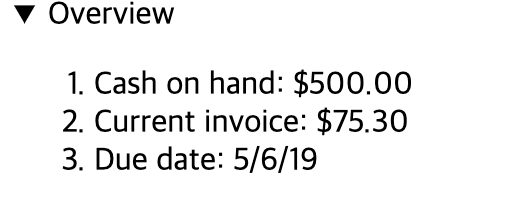

# 콘텐츠모델, 시멘틱마크업, 블록 & 라인

# 콘텐츠 모델
HTML5에는 요소들이 가지고 있는 성격에 따라 요소의 종류를 정의하는 규칙들이 있습니다. <br>
요소는 이 규칙들을 준수해야 하며, 반드시 HTML 권고안을 따라야 합니다. <br>
이런 규칙에 대해 비슷한 성격의 요소들끼리 그룹화한 것이 콘텐츠 모델이며, <br>
각각의 요소들은 하나 또는 여러 개의 콘텐츠 모델에 속하게 됩니다. <br>

## Content Models 의 7분류


- Metadata Content (style, title, script)
- Flow Content (a, address, sub, table)
- Sectioning Content (article, aside, nav, section)
- Heading Content (h1, h2 ,h3 ...)
- Pharsing Content (텍스트 또는 문단 내부 레벨로 사용되는 요소들이 포함됩니다.)
- Emebeded Content (외부요소)
- Interactive Content (상호작용하는 요소)

## 시멘틱 마크업
시멘틱 마크업은 종종 POSH(Plain Old Semantic HTML)라고도 불리는데,단어 그대로 평범하고 오래된 의미론적인 HTML이라는 뜻입니다. 시멘틱은 즉, 기계(컴퓨터,브라우저)가 잘 이해할 수 있도록 하는 것을 뜻합니다.
<strong>시멘틱 마크업은 적절한 HTML 요소를 올바르게 사용하는 것에서 시작합니다. </strong>

## 시멘틱 마크업 하기
- 정해진 약속을 잘 지키자.
- 의미에 맞는 태그를 사용하자.
- 문서를 표현할 때 구조화를 잘하자.

## \<b> VS \<strong>
- 두 태그 눈에는 같은 결과지만 브라우저에서 해석할 때는 strong은 중요하다는 의미를 가지게 된다.
- 이 외에 \<i>는 단순히 기울어진 글자를 표현 하지만 , \<em>은 글자의 특정 부분을 강조하는 의미를 지닙니다.

# HTML5 시멘틱 요소
- \<article>
- \<aside>
- \<figcaption>
- \<figure>
- \<footer>
- \<header>
- \<main>
- \<mark>
- \<nav>
- \<section>
- \<time>

## \<article>
- 포럼, 게시물, 잡지, 신문기사, 블로그, 대화 형 위젯 같은 독립적으로 배포하거나 재상용성있는 구성입니다.
- 내부에는 \<h1> ~\<h6> 태그를 식별한다.
- \<article> > \<article>은 상위 기사와 관련된 내용입니다.
  - blog의 댓글은 blog와 관련 있다.
- 날짜 및 시간은 \<time> 요소의 datetime 속성을 사용하여 설명할 수 있습니다.
  
[소스코드](./src/article.html)

## \<aside>
- 콘텐츠가 문서의 주요 콘텐츠와 간접적으로 만 관련된 문선의 일부를 나타냅니다.

## \<figcaption>
- 부모 \<figure> 요소의 남지 내용을 설명하는 캡션 또는 범례를 나타냅니다.

## \<figure> 
- 잠재적으로 (\<figcation>)요소를 사용하여 지정되는 선택적 캡션과 함께 자체 포함 된 콘테츠츨 나타냅니다.

## \<footer>
- 바닥글을 나타냅니다.
- 바닥 글에는 일반적으로 섹션 작성자에 대한 정보, 저작권 데이터 또는 관련 문서에 대한 링크가 포합됩니다.

## \<header>
- 로고, 검색 양식, 작성자 이름 및 기타 요소도 포함 할 수 있습니다.

## \<main>
- \<body>의 주요 내용을 나타냅니다. 무선의 중심 주제 또는 응용 프로그램의 중심 기능과 직접 관련되거나 확장되는 콘텐츠로 구성됩니다.

## \<mark>
- Serveral species of <mark>salmander</mark> inhabit the
- \<mark>는 주변 문맥에서 표시된 구절의 관련성 또는 중요성으로 인해 참조 또는 표기 목적으로 표시되거나 강조된 텍스트를 나타냅니다.

## \<nav>
- 메뉴, 목차, 색인 등을 나타냅니다.

## \<section>
- HTML 문서 내에 포함된 독립형 섹션을 나타냅니다 (소단락 같은 느낌..?)

## \<summary>
- \<detail> 요소의 공개 상자에 대한 요약, 캡션 또는 범례를 지정 (상위 \<details> 요소의 상태가 열리고 닫힙니다.)
- \<detail> 요소의 첫 번째 자식으로 만 사용할 수 있습니다.
- 사용자가 요약을 클릭하면 상위 \<details>요소가 열리거나 닫히고 토클 이벤트가 \<details> 요소로 전송되어 상태를 변경을 할때 사용합니다.
```
<details open>
  <summary>Overview</summary>
  <ol>
    <li>Cash on hand: $500.00</li>
    <li>Current invoice: $75.30</li>
    <li>Due date: 5/6/19</li>
  </ol>
</details>
  ```
  

## \<time>
- 특정 기간을 나타냅니다. 
- 날짜를 기계가 읽을 수있는 형식으로 변환하는 datetime 속성을 포함하여 더 나은 검색 엔진 결과 또는 미리 알림과 같은 사용자 지정 기능을 사용할 수 있습니다.
```
<time datetime="2018-07-07">July 7</time> in London's Hyde Park.</p>
```
```
July 7 
```
